# LADA DC PANEL

Bu proje, Lada Samara araç için geliştirdiğimiz kontrol sistemidir. Farklı I2C cihazlarını, sensörleri, son kullanıcı odaklı kullanıcı arayüzünü ve ek çıkış bileşenlerini (buzzer, röle) tek çatı altında toplayarak, aracın veri okuma, kontrol ve alarm sistemlerini entegre bir şekilde sunmayı amaçlamaktadır.

## İçindekiler

- [Özellikler](#özellikler)
- [Bileşen Listesi](#bileşen-listesi)
- [Pin Bağlantıları](#pin-bağlantıları)
- [Çalışma Mantığı](#çalışma-mantığı)
- [Kurulum ve Yapılandırma](#kurulum-ve-yapılandırma)
- [Notlar ve İpuçları](#notlar-ve-ipuçları)
- [Resim Galerisi](#resim-galerisi)

## Özellikler

- **Çoklu I2C Cihaz Desteği:**  
  - 16x2 LCD ekran, DS1307 RTC ve ADXL345 ivmeölçerin aynı I2C hattında çalışması.
- **Sensör Okumaları:**  
  - DHT11 ile sıcaklık ve nem ölçümü.  
  - Su geçirmez sıcaklık sensörü DS18B20 ile motor su sıcaklığı ölçümü. 
- **Hareket ve Hız Ölçümü:**  
  - ADXL345 ivmeölçer ile aracın ivme değerleri üzerinden hız tahmini.
- **Kullanıcı Arayüzü:**  
  - Encoder (rotary) ile menü navigasyonu; encoder butonuyla seçim.
- **Alarm ve Kontrol:**  
  - Röle kontrolü ile otomatik/manuel modda cihaz kontrolü.
  - Buzzer ile uyarı sinyali.
- **WiFi Yönetimi:**  
  - WiFiManager ile hotspot üzerinden konfigürasyon.
  - Şuan sadece kablosuz üzerinden yazılım atmak için kullanılıyor. (Örneğin ileride eklenebilecek bir ekran üzeirnden, aracınıza bindiğinizde telefonunuzdan internet paylaşıp cihaz üzerinde hava durumu verilerini güncelleyebilirsiniz.)
- **Zaman Yönetimi:**  
  - DS1307 RTC ile otomatik saat senkronizasyonu.

## Bileşen Listesi

- **NodeMCU ESP8266**
- **16x2 LCD Ekran (I2C)**
- **DS1307 RTC Modülü (I2C)**
- **ADXL345 İvmeölçer (I2C)**
- **DHT11 Sıcaklık ve Nem Sensörü**
- **DS18B20 Sıcaklık Sensörü (OneWire)**
- **Su Geçirmez Sıcaklık Sensörü (OneWire)**
- **Rotary Encoder**  
  - CLK, DT ve basma (SW) sinyalleri
- **Buzzer**
- **Röle**

## Pin Bağlantıları

| Bileşen                        | Bağlantı          | NodeMCU Pin (Varsayılan)         |
|--------------------------------|-------------------|----------------------------------|
| **16x2 LCD (I2C)**             | SDA, SCL          | D2 (SDA), D1 (SCL)               |
| **DS1307 RTC (I2C)**           | SDA, SCL          | D2 (SDA), D1 (SCL)               |
| **ADXL345 (I2C)**              | SDA, SCL          | D2 (SDA), D1 (SCL)               |
| **DHT11**                      | Data              | D5                               |
| **DS18B20**                    | Data (OneWire)    | D2                               |
| **Su Sıcaklık Sensörü**        | Data (OneWire)    | D6                               |
| **Rotary Encoder - CLK**       | Dijital giriş     | D4                               |
| **Rotary Encoder - DT**        | Dijital giriş     | D8                               |
| **Rotary Encoder - SW**        | Dijital giriş     | D7                               |
| **Buzzer**                     | Dijital çıkış     | D0                               |
| **Röle**                       | Dijital çıkış     | D3                               |

## Çalışma Mantığı

Proje, araç içerisindeki çeşitli sensör verilerini okur ve LCD ekran üzerinde görsel olarak sunar.  
- I2C üzerinden bağlı cihazlar (LCD, RTC, ADXL345) tek hat üzerinde haberleşirken, DHT11 ile ortamın sıcaklık, nem gibi değerleri ölçülür.  
- Su sıcaklık sensörü bağımsız olarak OneWire protokolü ile veri sağlar.  
- Rotary encoder kullanıcının menüde gezinmesini sağlar; basma ve döndürme hareketleriyle farklı ayarlara erişim mümkün olur.  
- Röle ve buzzer aracılığıyla alınan sensör verileri doğrultusunda otomatik veya manuel kontrol gerçekleştirilmektedir.  
- WiFiManager sayesinde, ilk başlatmada hotspot üzerinden ağa bağlanma imkanı sunulmaktadır.

## Kurulum ve Yapılandırma

1. **Donanım Bağlantıları:**  
   Tabloda belirtilen bağlantılara uygun olarak tüm bileşenleri NodeMCU’ya bağlayın.

2. **Kod Yükleme:**  
   Gerekli kütüphaneler (`LiquidCrystal_I2C`, `RTClib`, `Adafruit_ADXL345`, `DHT`, `OneWire`, `DallasTemperature`, `WiFiManager`) kullanılarak oluşturulan Arduino projesini NodeMCU’ya yükleyin.

3. **İlk Açılış ve WiFi Ayarları:**  
   **(v0.2)**
   Cihaz ilk başlatıldığında, başlangıçta 3 saniyelik süre boyunca butona basılı tutulursa WiFi Manager modu başlatılır.
   Wifi Adı : "Kerim's Lada" | Şifre :  "k3r1mL4dA" 
   Bu default değerleri kodu yüklemeden önce kendinize göre düzenleyebilirsiniz.
   (hotspot açılır, 5 dakika içerisinde yazılım güncellemesi yapılabilir)
   **(v0.2)**
   Mevcut yazılımda kablosuz ağı kullanan bir özellik bulunmamaktadır.  
   Eğer 3 saniye süresi içerisinde butona basılı tutulmazsa, normal modda başlatılır.  
   
   
4. **Test ve Kalibrasyon:**  
   Menü navigasyonu, sensör okumaları ve diğer fonksiyonları kontrol ederek sistemin hatasız çalıştığına emin olun.

## Proje Resimleri

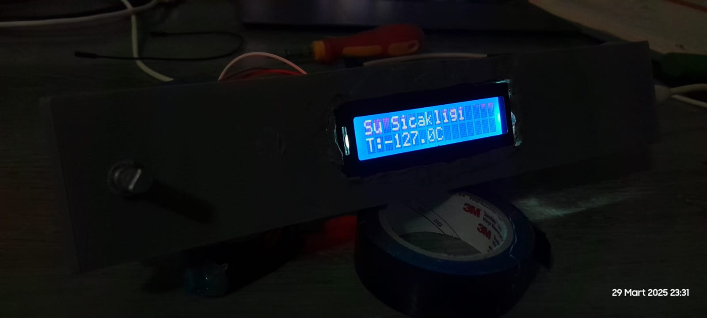
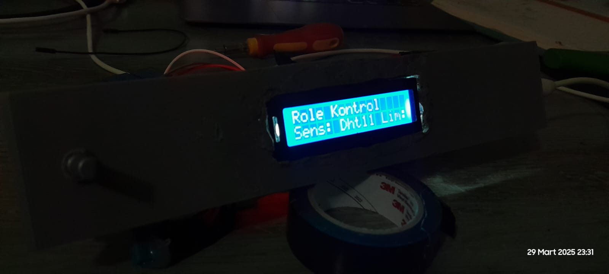
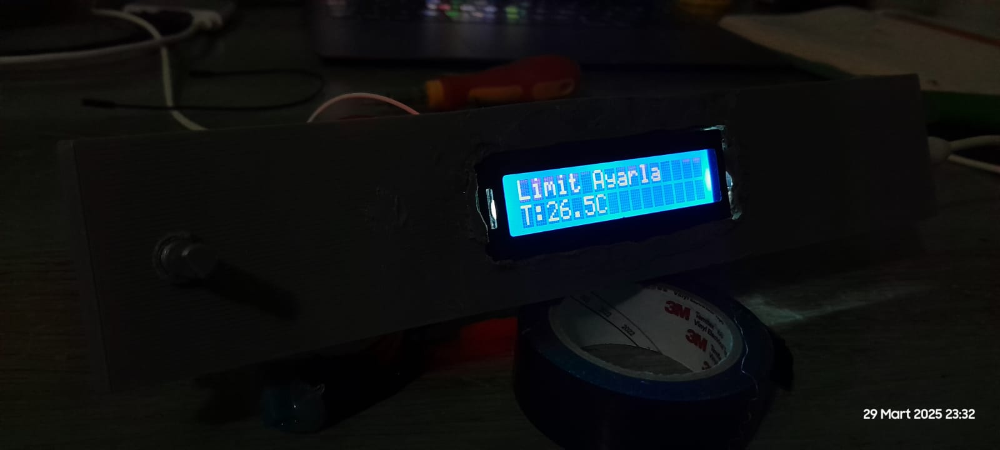
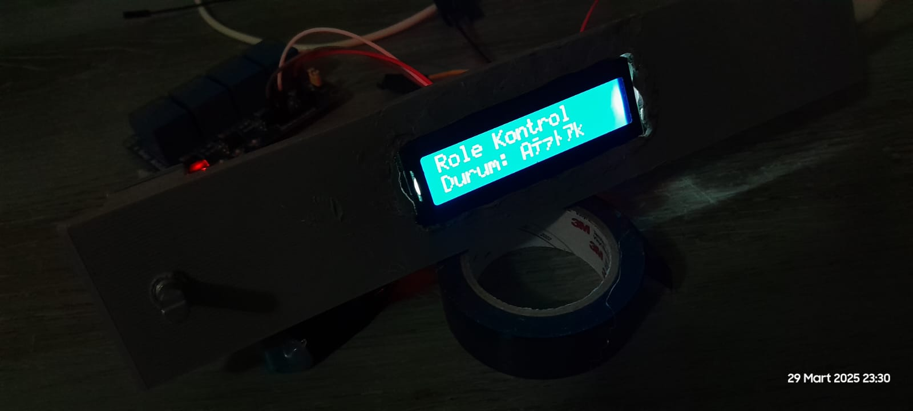
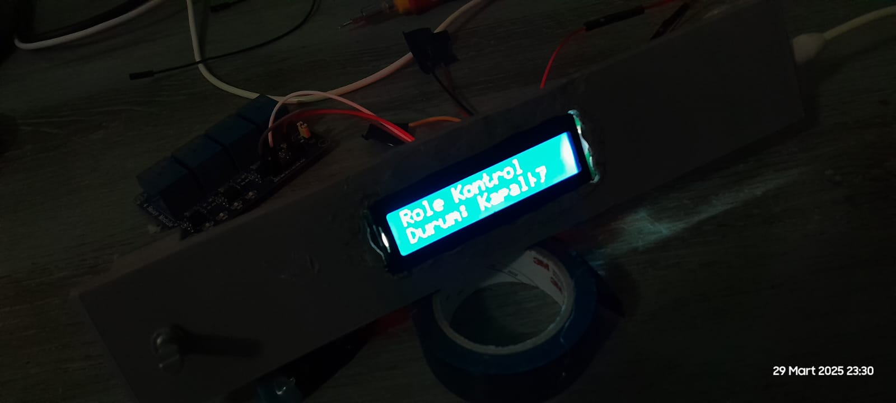
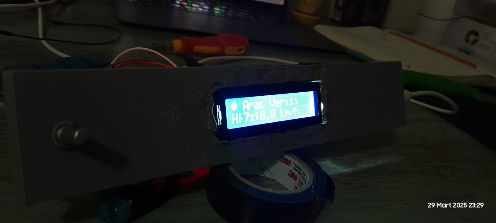
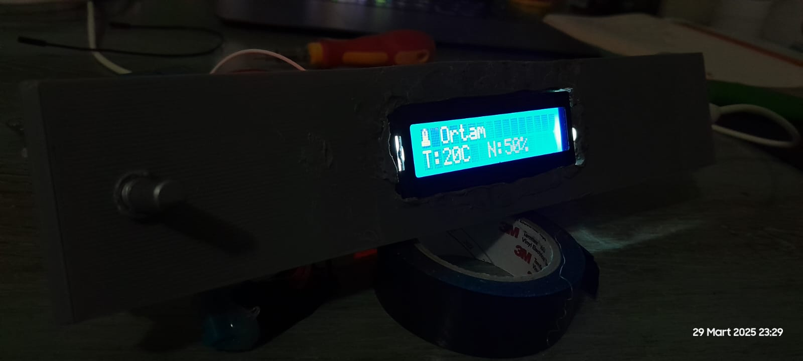
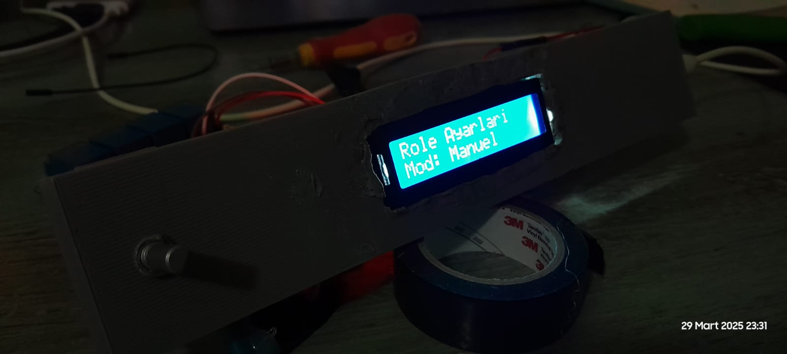
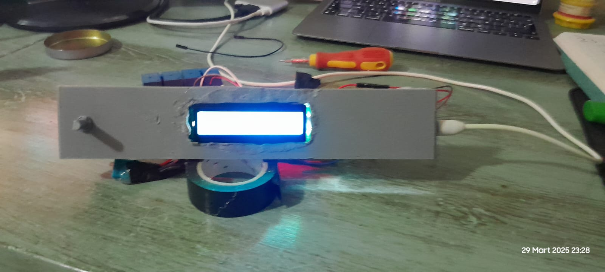
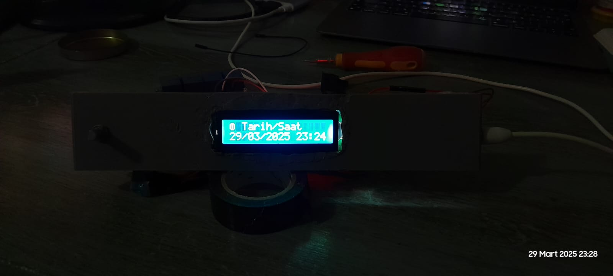
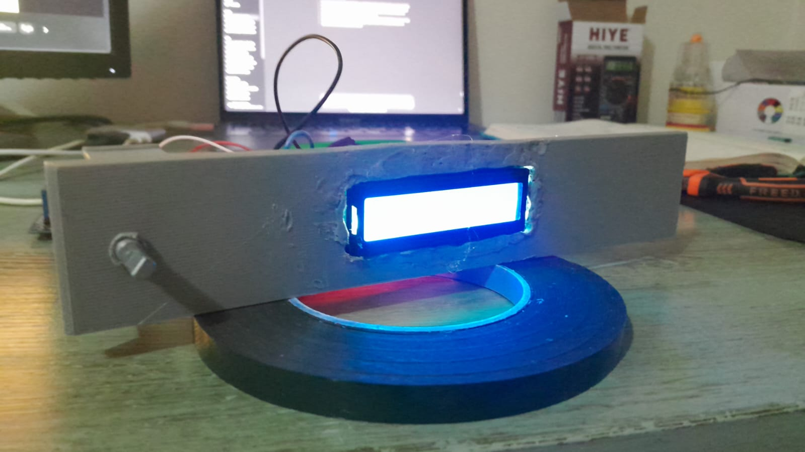
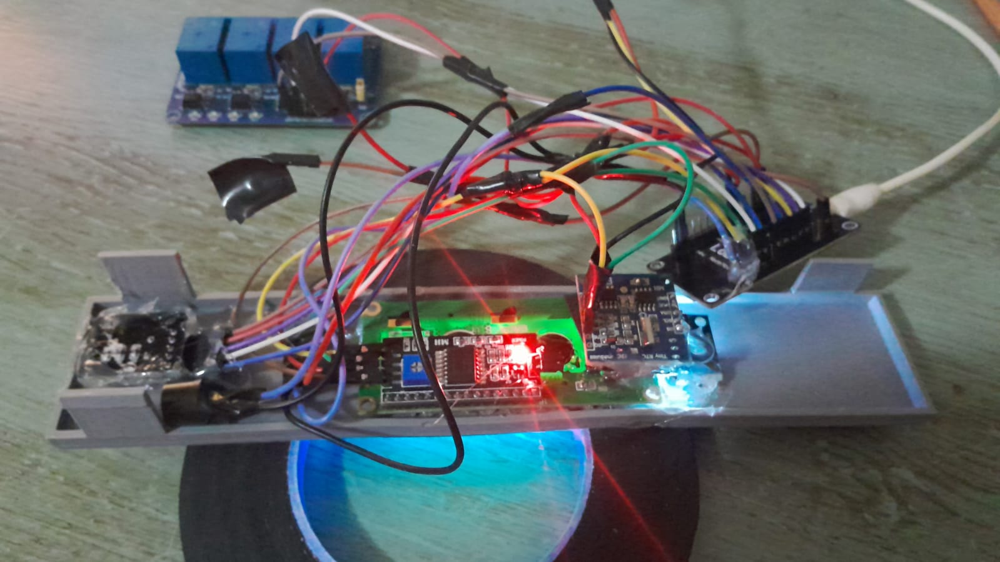
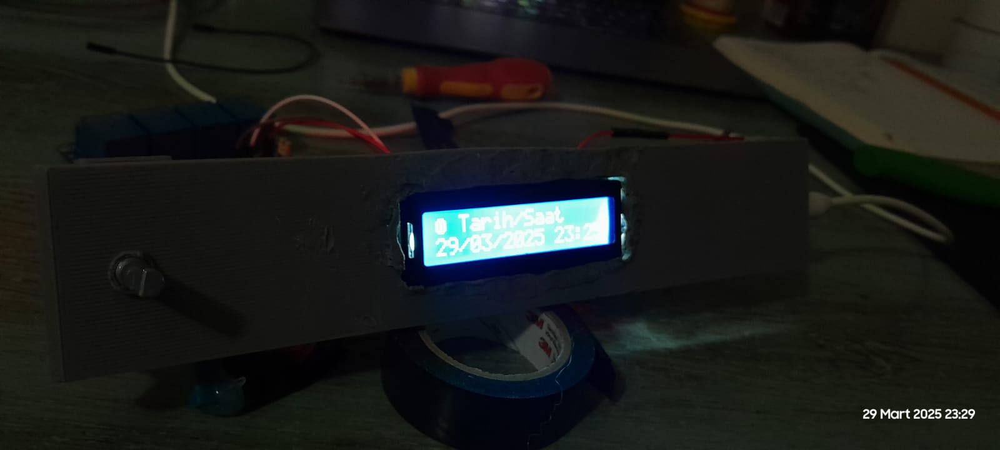

